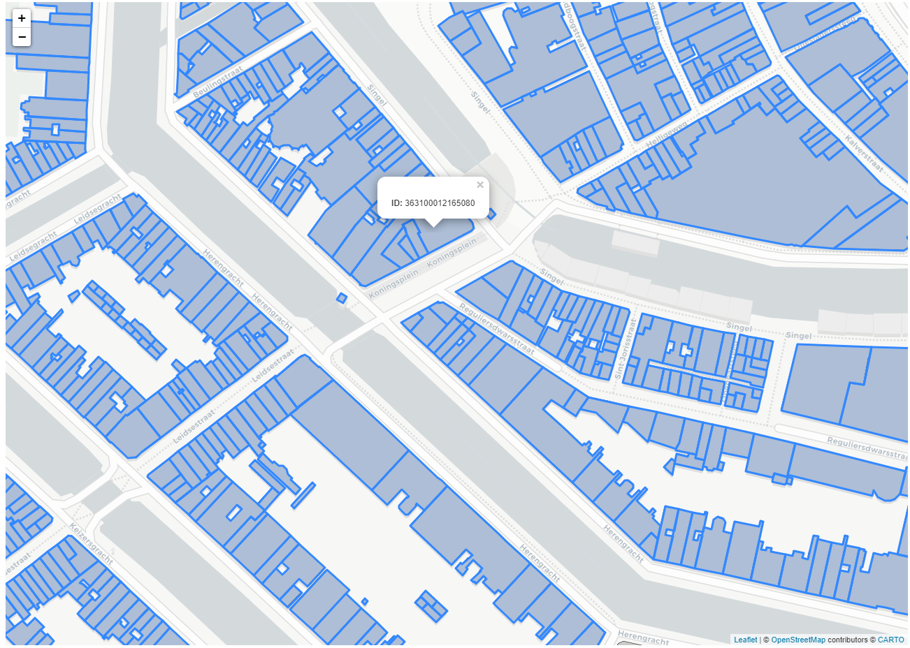

# leaflet-bag-viewer
Use this example to view the [BAG](https://www.geobasisregistraties.nl/basisregistraties/adressen-en-gebouwen) wfs layer in a Leaflet map. Features are retrieved from the BAG wfs based on the position of the screen on the map.

Use this example when:
1. You want to view the BAG wfs in a Leaflet map
2. Only load the feautures within the bounding box of the screen map to limit the number of features in the request and increase performance

### In this example
In script.js wfs features are added to a Leaflet map when the user reaches the required zoom level. When the required zoom level is reached the bounding box of the map screen is used as input to get features from the BAG wfs.

### Credits
- Leaflet 
https://github.com/Leaflet/Leaflet

- Proj4 
https://github.com/proj4js/proj4js

- BAG wfs 
https://www.nationaalgeoregister.nl/
